# Linux Automation Toolkit for System Administration & Monitoring (Bash)


---

Automated Linux system administration tasks using Bash, designed to improve system reliability, detect operational issues, and support system monitoring workflows.

> Simulated system administration and SOC-support automation tasks using Bash scripting, including monitoring, cleanup, backup, and alerting.
> Focused on practical automation scenarios that reflect real-world system administration and operational monitoring challenges.

---

## Overview

This project simulates real-world **system administration and SOC-support operations** by automating critical tasks such as system monitoring, file cleanup, backups, and alerting.

The goal is to demonstrate how automation improves:

* System reliability
* Incident response readiness
* Operational efficiency

---

## What This Project Demonstrates

- Automating repetitive Linux administration tasks  
- Detecting system issues (connectivity, disk usage)  
- Preventing operational failures (log overflow, missing backups)  
- Improving system reliability through scripting  

---

## Real-World Scenario

A Linux server environment experiences:

* Increasing disk usage due to log accumulation
* Intermittent network connectivity issues
* Lack of consistent system backups

---

### Automated Response

* Cleanup script removes old files to prevent disk exhaustion
* Connectivity script identifies unreachable hosts
* Backup script preserves system state for recovery

This demonstrates how automation helps prevent system failures and improves operational reliability.

---

## System Monitoring

<p align="center">
  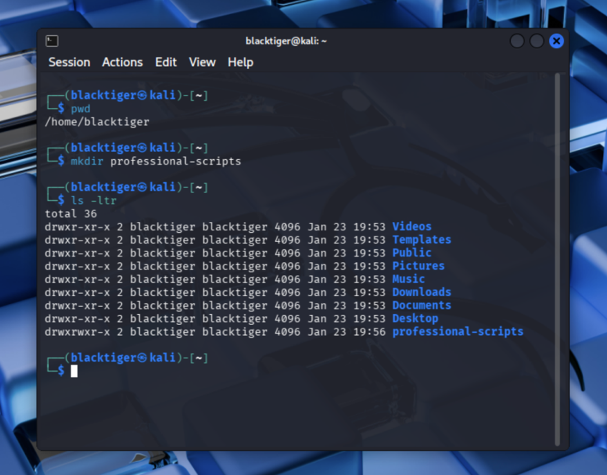
</p>

<p align="center">
  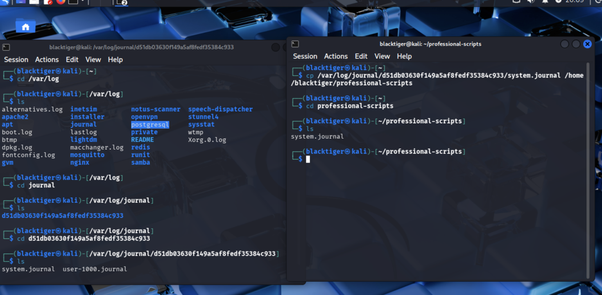
</p>

---

## SOC Integration (Why this matters)

In real environments, system administrators and monitoring teams rely on automation to:

* Detect abnormal system behavior
* Maintain system reliability
* Prevent disk exhaustion (log flooding scenarios)
* Ensure backups for recovery

### Operational Impact

* Disk exhaustion can disrupt logging pipelines
* Connectivity failures can hide system issues
* Missing backups delay recovery

Automation helps prevent these issues before they escalate.

---

## Features

### Connectivity Monitoring

<p align="center">
  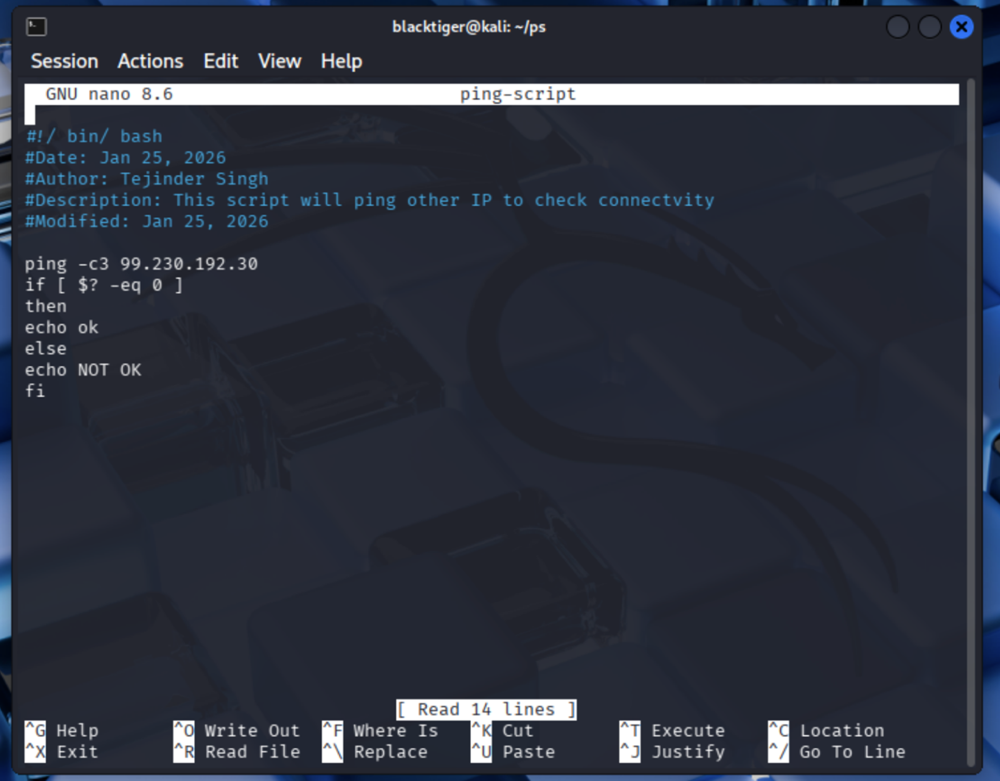
</p>
<p align="center"><em>Ping script logic</em></p>

<p align="center">
  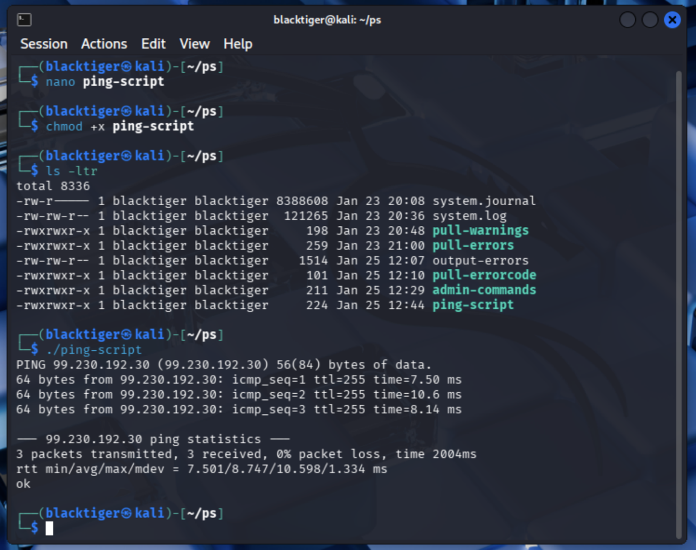
</p>
<p align="center"><em>Connectivity result</em></p>

---

### Automated File Cleanup

<p align="center">
  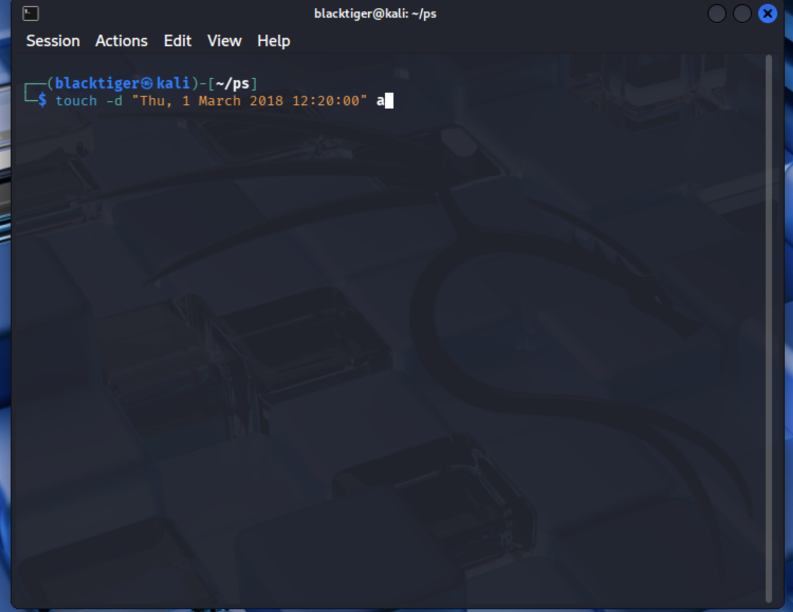
</p>
<p align="center"><em>Disk usage issue</em></p>

<p align="center">
  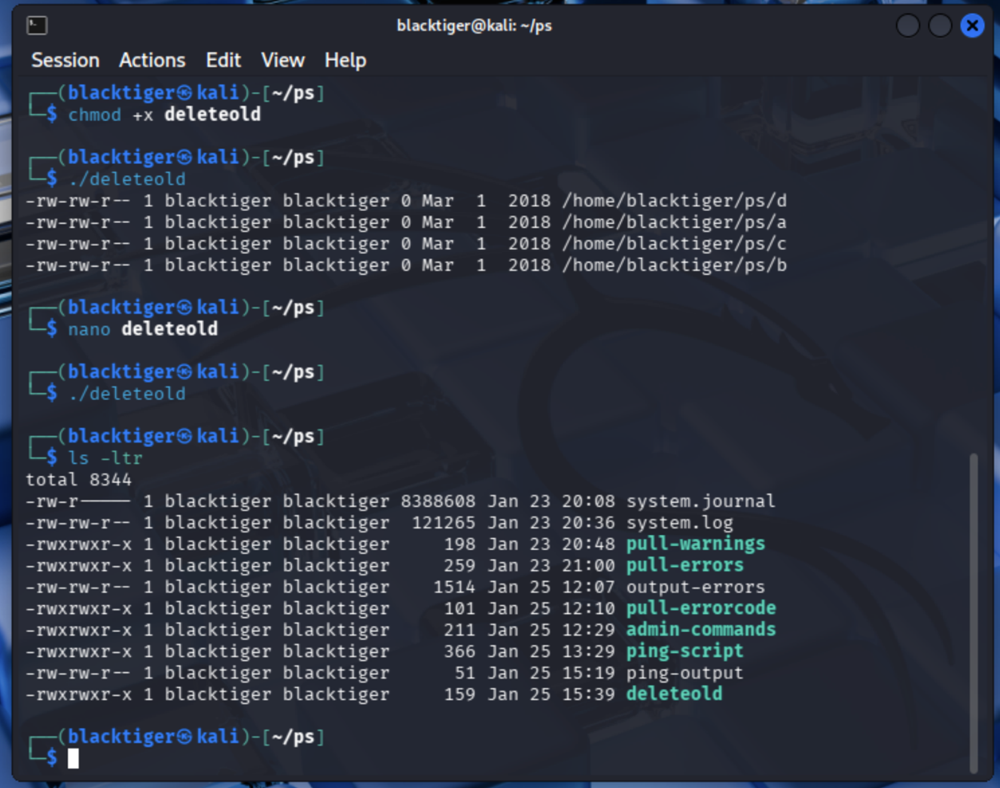
</p>
<p align="center"><em>Cleanup result</em></p>

---

### Backup Automation

<p align="center">
  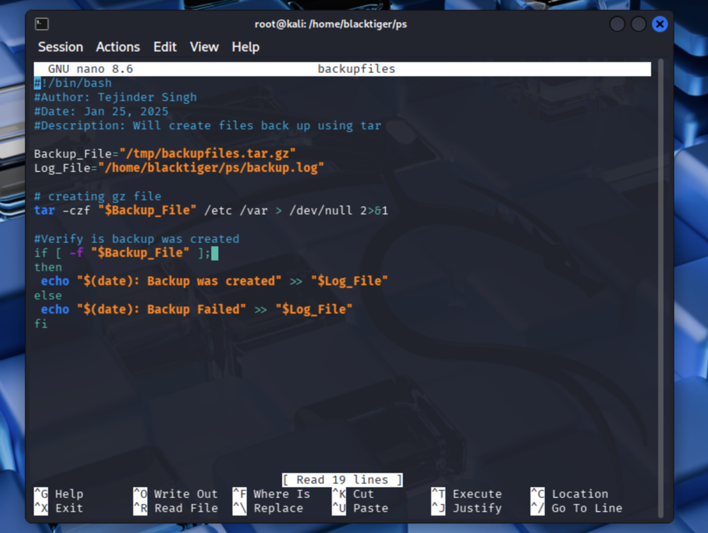
</p>
<p align="center"><em>Backup execution</em></p>

<p align="center">
  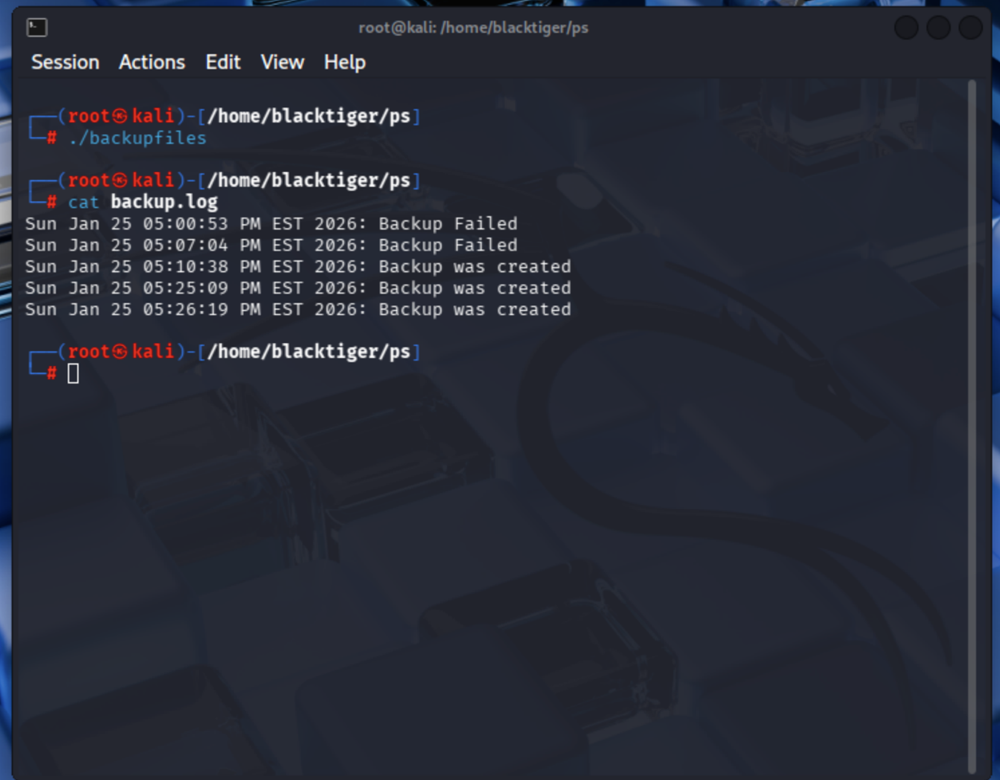
</p>
<p align="center"><em>Backup result</em></p>

---

### Task Scheduling (Cron)

<p align="center">
  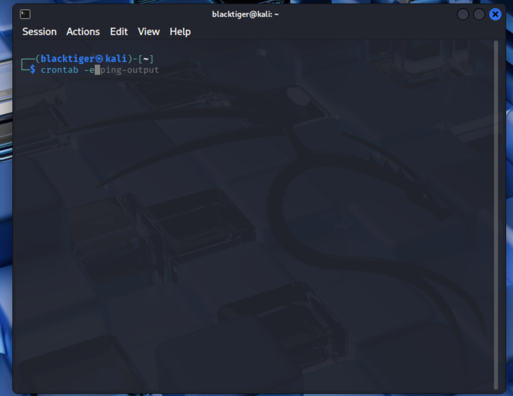
</p>
<p align="center"><em>Cron configuration</em></p>

---

### File Operations & Permissions

<p align="center">
  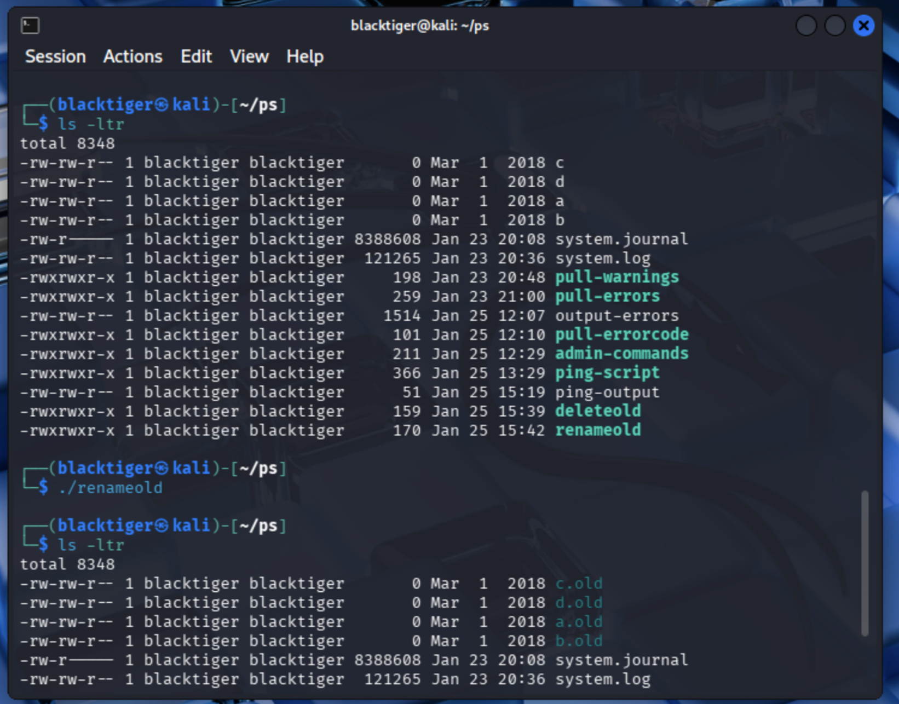
</p>
<p align="center"><em>File rename result</em></p>

<p align="center">
  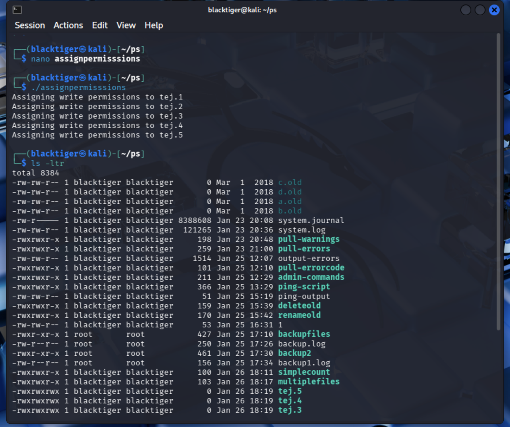
</p>
<p align="center"><em>Permission validation</em></p>

---

## Detection Perspective

These scripts simulate early indicators used in monitoring:

* Failed connectivity → possible system/network issue
* Rapid file growth → abnormal disk usage
* Permission changes → potential misconfiguration

These signals form the foundation for monitoring and alerting systems used in real environments.

---

## Scripts Included

| Script                 | Description                                |
| ---------------------- | ------------------------------------------ |
| connectivity_check.sh  | Checks remote server availability          |
| cleanup_old_files.sh   | Deletes files older than defined threshold |
| backup_system.sh       | Creates compressed backups                 |
| file_operations.sh     | Automates file creation and renaming       |
| permissions_manager.sh | Manages file permissions                   |
| alert_script.sh        | Generates system alerts                    |

---

## Usage

### Connectivity Check

```bash
./connectivity_check.sh
```

### Cleanup

```bash
./cleanup_old_files.sh /var/log
```

### Backup

```bash
./backup_system.sh
```

---

## Automation Example

```bash
0 2 * * * /path/to/backup_system.sh
```

---

## SOC Use-Case Mapping

| Script                 | SOC Function       | Description                |
| ---------------------- | ------------------ | -------------------------- |
| connectivity_check.sh  | Network Monitoring | Detects host availability  |
| cleanup_old_files.sh   | Log Management     | Prevents disk overflow     |
| backup_system.sh       | Recovery           | Enables system restoration |
| file_operations.sh     | Automation         | Simulates file operations  |
| permissions_manager.sh | Security           | Manages access control     |
| alert_script.sh        | Alerting           | Generates alerts           |

---

## Validation

<p align="center">
  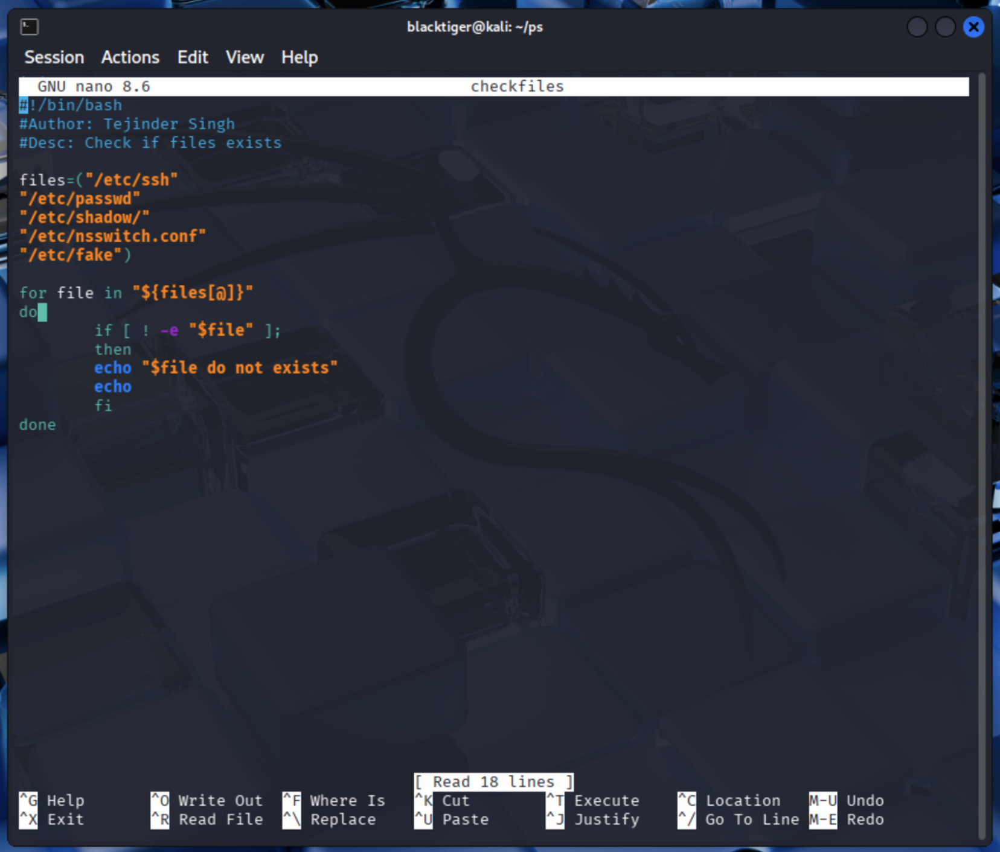
</p>

---

## Impact

* Automated repetitive admin tasks
* Reduced manual workload
* Improved system reliability
* Enhanced monitoring readiness
* Prevented disk exhaustion scenarios
* Improved system visibility

---

## Skills Demonstrated

* Linux System Administration
* Bash Scripting
* Automation & Scheduling
* File System Management
* Process Monitoring

---

## Summary

This project highlights practical Linux automation skills that improve system stability, reduce manual effort, and support reliable operations in production environments.

## Author

**Tejinder Singh**
