# Linux System Administration & SOC Automation Toolkit (Bash)


---

> Simulated system administration and SOC-support automation tasks using Bash scripting, including monitoring, cleanup, backup, and alerting.

---

## Overview

This project simulates real-world **system administration and SOC-support operations** by automating critical tasks such as system monitoring, file cleanup, backups, and alerting.

The goal is to demonstrate how automation improves:

* System reliability
* Incident response readiness
* Operational efficiency

---

## System Monitoring

<p align="center">
  
</p>
<p align="center"><em>System resource visibility</em></p>

<p align="center">
  
</p>
<p align="center"><em>Disk usage monitoring</em></p>

---

## SOC Integration (Why this matters)

In real environments, SOC teams rely on system-level automation for:

* Detecting abnormal system behavior
* Maintaining log integrity
* Preventing disk exhaustion (log flooding attacks)
* Ensuring backups for forensic analysis

This toolkit supports SOC operations by automating these foundational tasks.

---

## Features

### Remote Connectivity Monitoring

* Check availability of remote servers
* Detect downtime or unreachable hosts

<p align="center">
  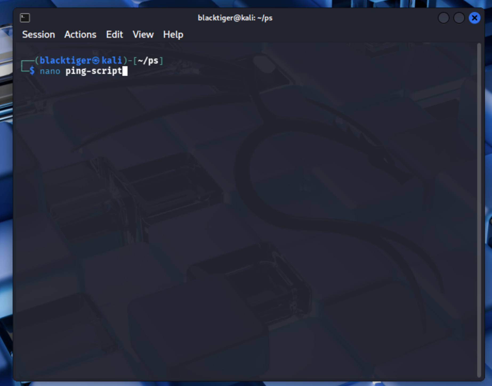
</p>
<p align="center"><em>Ping script creation</em></p>

<p align="center">
  
</p>
<p align="center"><em>Initial script logic</em></p>

<p align="center">
  
</p>
<p align="center"><em>Execution showing connectivity results</em></p>

<p align="center">
  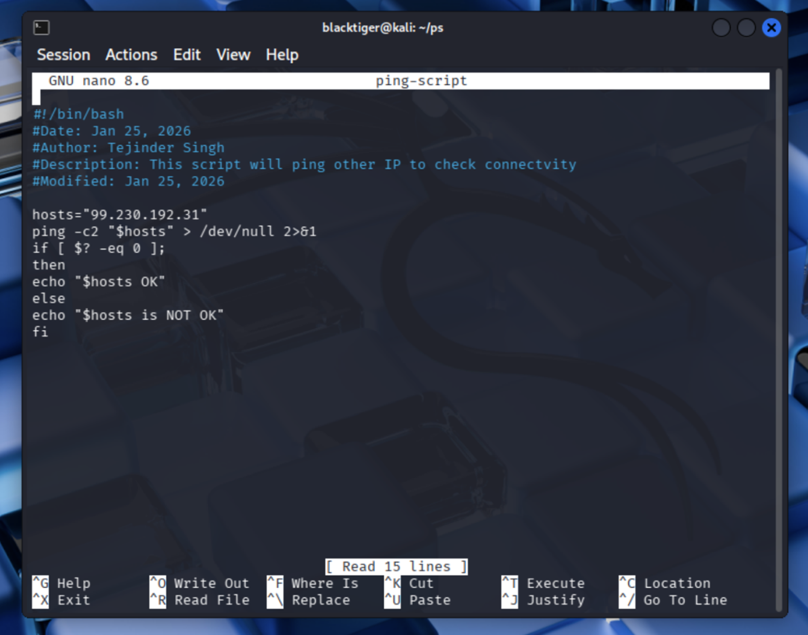
</p>
<p align="center"><em>Optimized script</em></p>

<p align="center">
  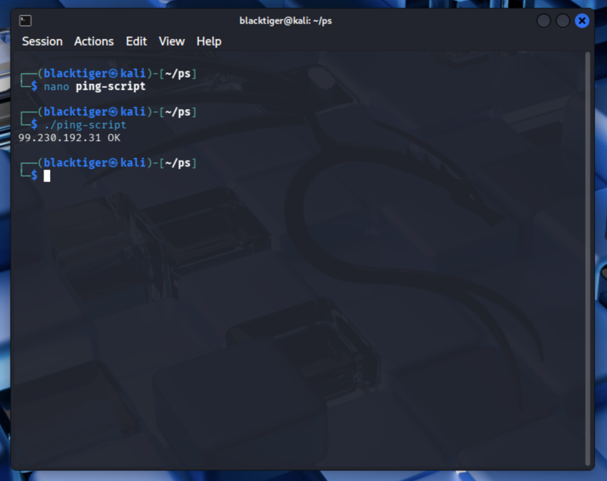
</p>
<p align="center"><em>Connectivity output</em></p>

<p align="center">
  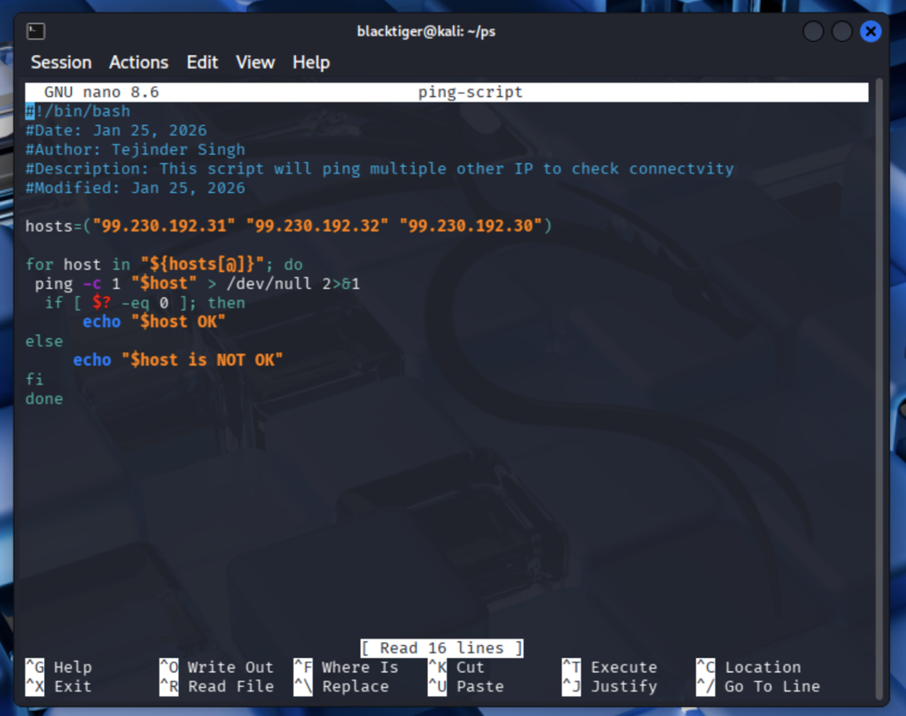
</p>
<p align="center"><em>Remote connectivity validation</em></p>

---

### Automated File Cleanup

* Delete files older than 90 days
* Prevent disk space exhaustion

<p align="center">
  
</p>
<p align="center"><em>Problem: old files consuming space</em></p>

<p align="center">
  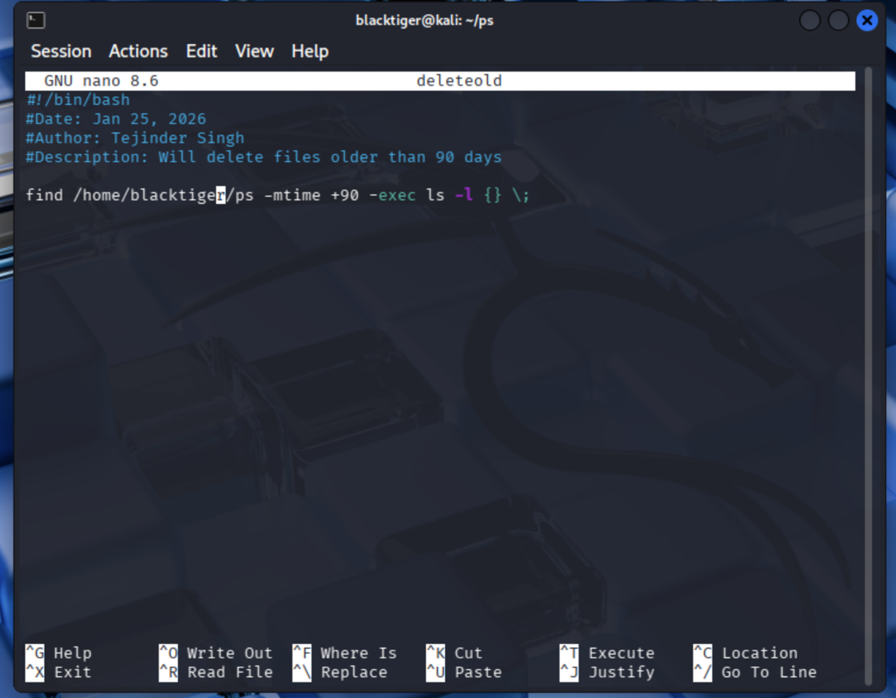
</p>
<p align="center"><em>Verification before deletion</em></p>

<p align="center">
  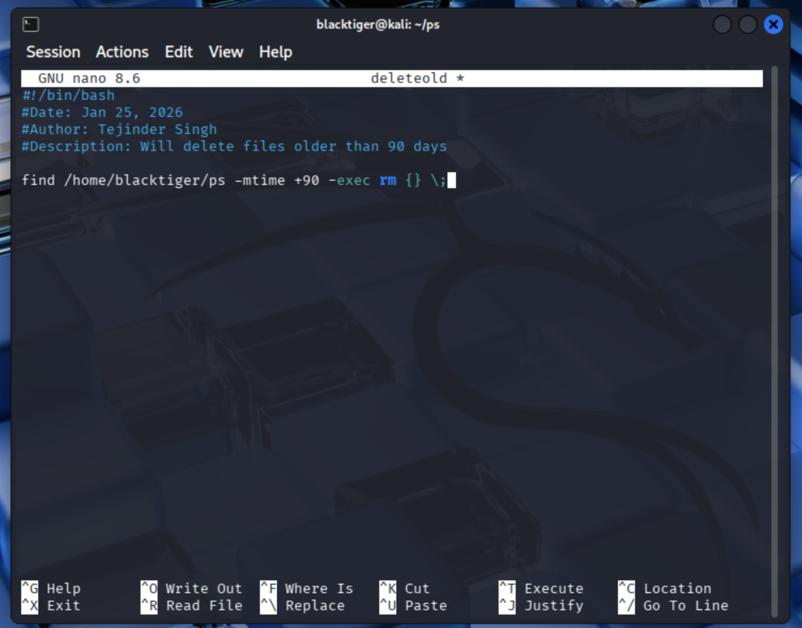
</p>
<p align="center"><em>Cleanup logic</em></p>

<p align="center">
  
</p>
<p align="center"><em>Execution and resolution</em></p>

---

### Backup Automation

* Backup `/etc` and `/var` directories
* Timestamped archive creation

<p align="center">
  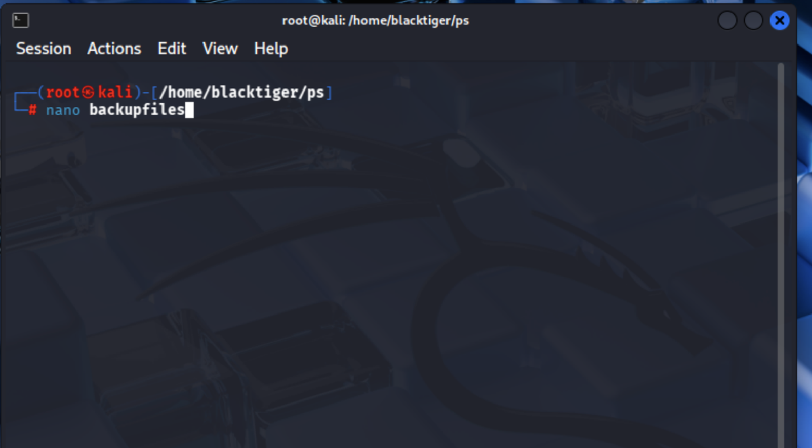
</p>
<p align="center"><em>Backup script</em></p>

<p align="center">
  
</p>
<p align="center"><em>Backup execution</em></p>

<p align="center">
  
</p>
<p align="center"><em>Backup files created</em></p>

---

### Task Scheduling

* Automate execution using cron jobs

<p align="center">
  
</p>
<p align="center"><em>Cron job configuration</em></p>

<p align="center">
  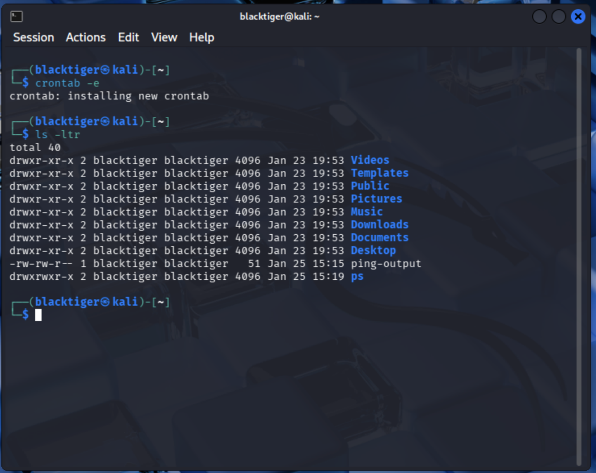
</p>
<p align="center"><em>Automated execution</em></p>

---

### Alerting & Notifications

* Send alerts for failures or status updates

<p align="center">
  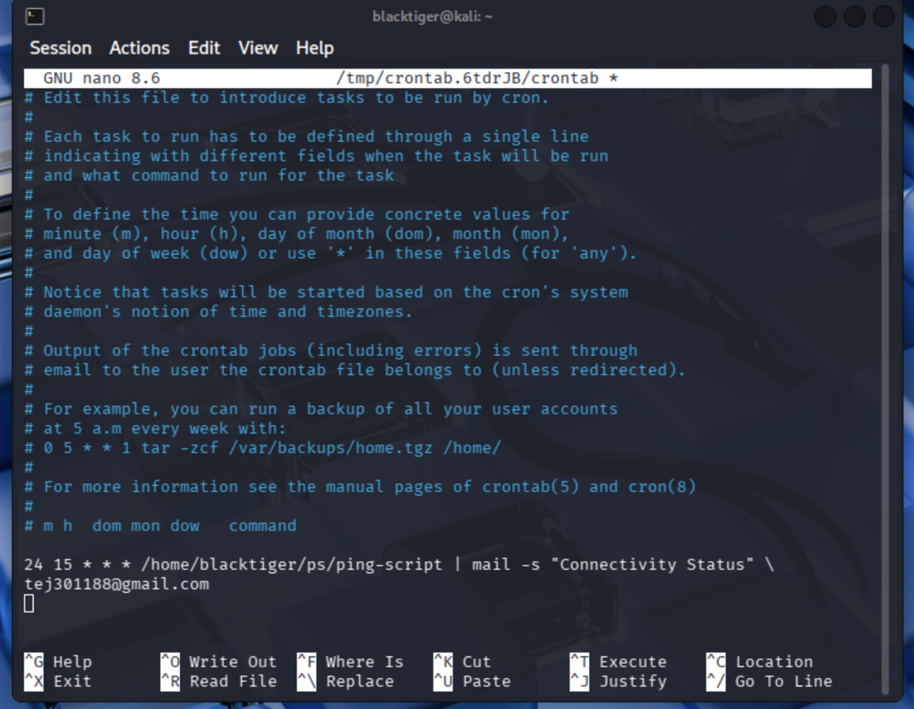
</p>
<p align="center"><em>Email alert system</em></p>

---

### File Management

* Bulk file creation
* Rename files
* Modify permissions

<p align="center">
  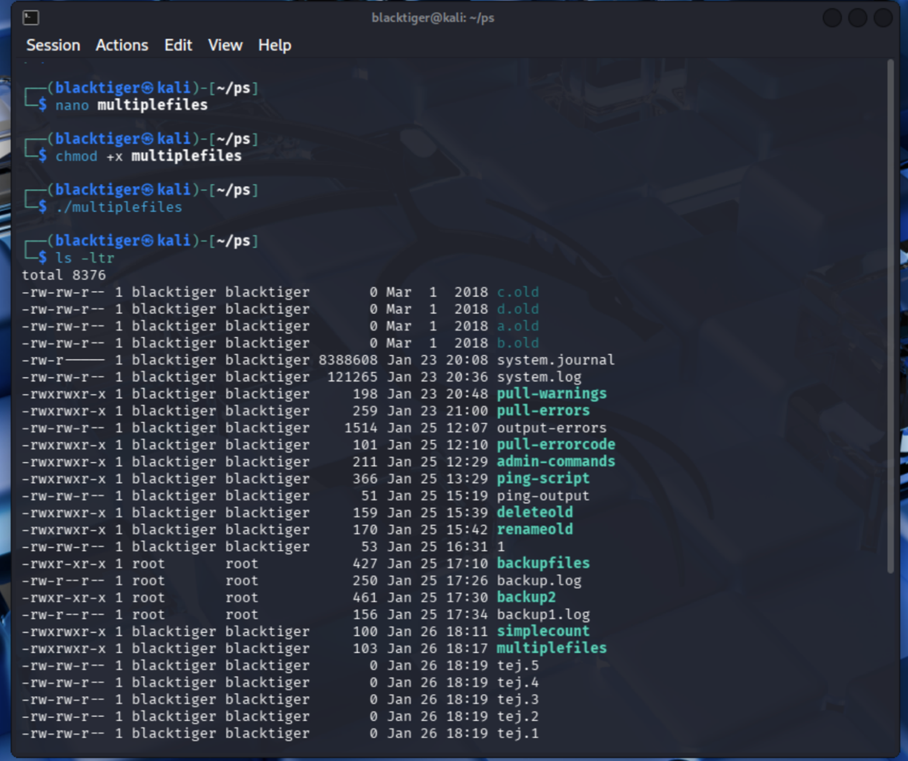
</p>
<p align="center"><em>Automated file creation</em></p>

<p align="center">
  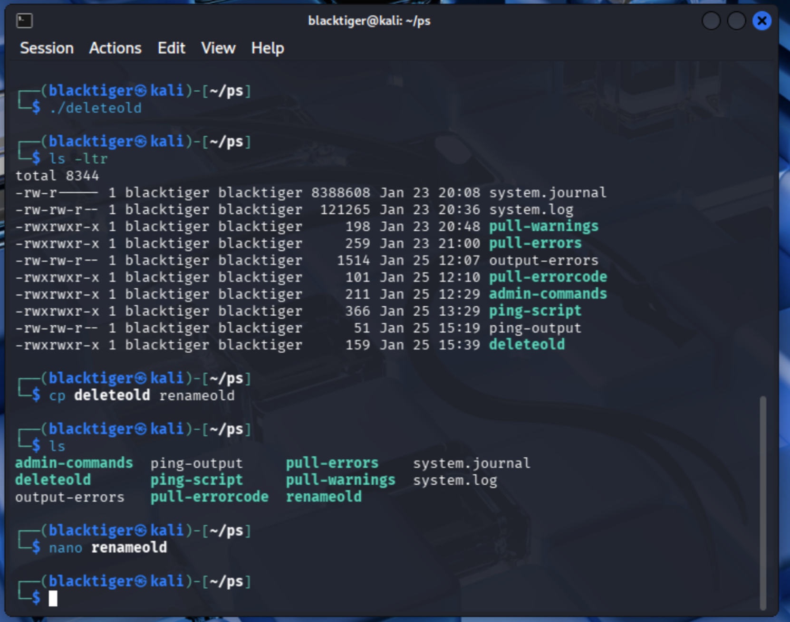
</p>
<p align="center"><em>Rename script</em></p>

<p align="center">
  
</p>
<p align="center"><em>Rename result</em></p>

<p align="center">
  
</p>
<p align="center"><em>Permission validation</em></p>

---

## SOC Use Cases

| Scenario                 | Automation Impact                    |
| ------------------------ | ------------------------------------ |
| Log flooding attack      | Cleanup prevents disk exhaustion     |
| Server outage            | Connectivity script detects downtime |
| Incident investigation   | Backups preserve forensic data       |
| Suspicious file activity | File monitoring & validation         |

---

## Scripts Included

| Script                 | Description                             |
| ---------------------- | --------------------------------------- |
| connectivity_check.sh  | Checks remote server availability       |
| cleanup_old_files.sh   | Deletes files older than 90 days        |
| backup_system.sh       | Creates backups of critical directories |
| file_operations.sh     | Handles file creation and renaming      |
| permissions_manager.sh | Assigns file permissions                |

---

## Script Examples

### 🔎 Connectivity Check

```bash
./connectivity_check.sh google.com
```

### Cleanup Old Files

```bash
./cleanup_old_files.sh /var/log
```

### Backup System

```bash
./backup_system.sh
```

---

## Automation (Cron Example)

```bash
0 2 * * * /path/to/backup_system.sh
```

Runs backup daily at 2 AM

---

## 🔎 Validation

<p align="center">
  
</p>
<p align="center"><em>File existence validation</em></p>

<p align="center">
  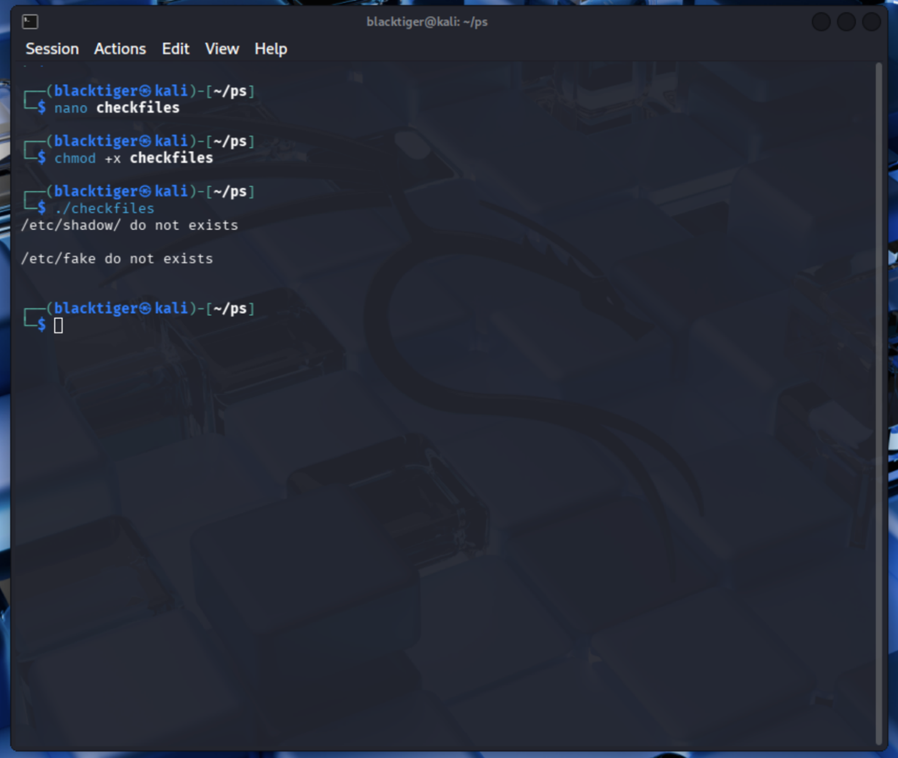
</p>
<p align="center"><em>Remote file validation</em></p>

---

## Impact

* Automated repetitive admin tasks
* Reduced manual workload
* Improved system reliability
* Enhanced SOC readiness

---

## Skills Demonstrated

* Linux System Administration
* Bash Scripting
* Automation & Scheduling
* SOC Support Operations
* Incident Readiness

---

## Author

**Tejinder Singh**
